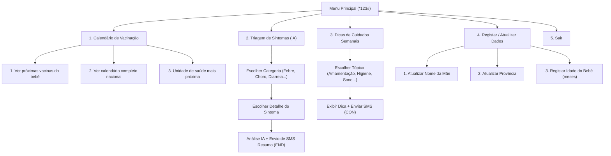

# Documentação Técnica Completa da API - Kutatela Mama 🌿

> **Versão da API:** 1.0.0  
> **Framework:** Spring Boot 3.x (Java 17+)  
> **Formato de Resposta:** `application/json` (para REST API) e `text/plain` (para USSD)  
> **Codificação de Caracteres:** UTF-8  

---

## 1. Visão Geral da Plataforma

O **Kutatela Mama** é uma plataforma de saúde digital materno-infantil adaptada ao contexto angolano. O sistema oferece:

1. **Registo e Gestão de Mães e Bebés**: Acompanhamento de recém-nascidos e lactentes por província/município.
2. **Calendário Nacional de Vacinação PNI (Programa Nacional de Imunização)**: Mapeamento de doses (BCG, Polio, Pentavalente, Rotavírus, Febre Amarela, Tríplice Viral/VAS) e agendamento automático.
3. **Triagem Clínica Inteligente (IA Gemini + Motor Clínico Fallback)**: Avaliação de sintomas urgentes (febre, choro persistente, diarreia, borbulhas, dificuldade na amamentação) com classificação por nível de alarme (`NORMAL`, `WARNING`, `URGENT`).
4. **Notificações por SMS e Automatização de Lembretes**: Envio de alertas de vacinações e dicas semanais de saúde (em Português e Umbundu).
5. **Integração USSD (Africa's Talking Callback & JSON Test)**: Permite que mães sem acesso a smartphone ou internet utilizem o serviço via telemóveis analógicos simples (`*123#` / `*384*23898#`).

---

## 2. Servidores e Ambientes

| Ambiente | Base URL | Descrição |
| :--- | :--- | :--- |
| **Desenvolvimento Local** | `http://localhost:8080` | Execução local com H2 In-Memory DB |
| **Produção AWS** | `http://<seu-dominio-ou-ip-aws>:8080` | Execução em Docker / PostgreSQL |

---

## 3. Estrutura das Enums

### 3.1 `SymptomCategory`
Define as categorias de sintomas disponíveis para a triagem.

| Valor Enum | Descrição |
| :--- | :--- |
| `CHORO_PERSISTENTE` | Choro persistente |
| `BORBULHAS_ERUPCOES` | Borbulhas e erupções cutâneas |
| `FEBRE` | Febre |
| `DIARREIA_VOMITOS` | Diarreia e vómitos |
| `DIFICULDADE_MAMAR` | Dificuldade para mamar |
| `OUTRO` | Outros sintomas |

---

### 3.2 `AlarmLevel`
Nível de gravidade / alarme atribuído pela triagem clínica/IA.

| Valor Enum | Título | Emoji | Significado |
| :--- | :--- | :--- | :--- |
| `NORMAL` | Normal | 💚 | Cuidados em casa / observação |
| `WARNING` | Atenção | ⚠️ | Monitorizar e procurar posto de saúde se persistir |
| `URGENT` | Urgente | 🚨 | Encaminhamento imediato ao posto/hospital |

---

### 3.3 `VaccineStatus`
Estado de uma vacina no histórico/agenda do bebé.

| Valor Enum | Rótulo | Ícone | Significado |
| :--- | :--- | :--- | :--- |
| `SCHEDULED` | Agendada | ⏳ | Vacina pendente ou agendada para o futuro |
| `COMPLETED` | Realizada | ✅ | Vacina administrada com sucesso |
| `OVERDUE` | Atrasada | 🔴 | Vacina fora do prazo recomendado |

---

### 3.4 `Language`
Idiomas suportados para envio de dicas e notificações.

| Valor Enum | Nome Exibido |
| :--- | :--- |
| `PORTUGUESE` | Português |
| `UMBUNDU` | Umbundu |

---

## 4. Endpoints da API REST

### 4.1 Mães (`/api/v1/mothers`)

#### `GET /api/v1/mothers`
Lista todas as mães registadas no sistema.

* **Parâmetros de Requisição:** Nenhum.
* **Código de Sucesso:** `200 OK`
* **Exemplo de Resposta:**
```json
[
  {
    "id": 1,
    "phoneNumber": "+244923111222",
    "fullName": "Maria Chitumba",
    "province": "Huambo",
    "municipality": "Caála",
    "preferredLanguage": "PORTUGUESE",
    "createdAt": "2026-07-26T20:00:00"
  }
]
```

---

#### `GET /api/v1/mothers/{id}`
Obtém os detalhes de uma mãe específica pelo ID.

* **Parâmetros de Caminho:**
  * `id` (Long, Obrigatório): ID da mãe.
* **Códigos de Resposta:**
  * `200 OK`: Mãe encontrada.
  * `404 Not Found`: Mãe não encontrada.

---

#### `GET /api/v1/mothers/phone/{phoneNumber}`
Obtém os detalhes de uma mãe através do número de telefone.

* **Parâmetros de Caminho:**
  * `phoneNumber` (String, Obrigatório): Número de telefone (ex: `+244923111222`).
* **Códigos de Resposta:**
  * `200 OK`: Mãe encontrada.
  * `404 Not Found`: Mãe não encontrada.

---

#### `POST /api/v1/mothers`
Regista uma nova mãe e automaticamente o seu bebé primário, agendando todo o calendário nacional de vacinação do PNI.

* **Corpo da Requisição (`MotherRegistrationDto`):**
```json
{
  "phoneNumber": "+244925999888",
  "fullName": "Ana Paula Silva",
  "province": "Huambo",
  "municipality": "Huambo",
  "babyName": "Bernardo Silva",
  "babyGender": "M",
  "babyAgeMonths": 2
}
```

* **Regras de Validação:**
  * `phoneNumber`: Obrigatório (não vazio).
  * `fullName`: Obrigatório (não vazio).
  * `province`: Obrigatório (não vazio).
  * `babyName`: Obrigatório (não vazio).

* **Código de Sucesso:** `201 Created`
* **Exemplo de Resposta:**
```json
{
  "id": 3,
  "phoneNumber": "+244925999888",
  "fullName": "Ana Paula Silva",
  "province": "Huambo",
  "municipality": "Huambo",
  "preferredLanguage": "PORTUGUESE",
  "createdAt": "2026-07-26T21:15:00"
}
```

---

### 4.2 Bebés (`/api/v1/babies`)

#### `GET /api/v1/babies`
Lista todos os bebés registados.

* **Código de Sucesso:** `200 OK`

---

#### `GET /api/v1/babies/{id}`
Obtém os detalhes de um bebé específico pelo ID.

* **Parâmetros de Caminho:**
  * `id` (Long, Obrigatório): ID do bebé.
* **Códigos de Resposta:**
  * `200 OK` | `404 Not Found`

---

#### `GET /api/v1/babies/mother/{motherId}`
Lista todos os bebés associados a uma determinada mãe.

* **Parâmetros de Caminho:**
  * `motherId` (Long, Obrigatório): ID da mãe.
* **Código de Sucesso:** `200 OK`
* **Exemplo de Resposta:**
```json
[
  {
    "id": 1,
    "mother": { "id": 1, "fullName": "Maria Chitumba" },
    "fullName": "Mateus Chitumba",
    "gender": "M",
    "birthDate": "2026-05-21",
    "ageInMonths": 2,
    "createdAt": "2026-07-26T20:00:00"
  }
]
```

---

### 4.3 Vacinação (`/api/v1/vaccinations`)

#### `GET /api/v1/vaccinations/vaccines`
Lista o catálogo de vacinas do Programa Nacional de Imunização de Angola, ordenadas pela idade recomendada em meses.

* **Código de Sucesso:** `200 OK`
* **Exemplo de Resposta:**
```json
[
  {
    "id": 1,
    "name": "BCG",
    "recommendedAgeMonths": 0,
    "targetDisease": "Tuberculose",
    "description": "Dose única ao nascer. Protege contra formas graves de tuberculose (meningite tuberculosa)."
  },
  {
    "id": 3,
    "name": "Pentavalente 1ª Dose",
    "recommendedAgeMonths": 2,
    "targetDisease": "Difteria, Tétano, Coqueluche, Hepatite B, Hib",
    "description": "Protege contra 5 doenças graves. Aplicar aos 2 meses."
  }
]
```

---

#### `GET /api/v1/vaccinations/national-calendar`
Retorna o texto formatado do calendário vacinal nacional de Angola juntamente com a lista de vacinas.

* **Código de Sucesso:** `200 OK`
* **Exemplo de Resposta:**
```json
{
  "calendarText": "📋 CALENDÁRIO NACIONAL DE VACINAÇÃO (PNI ANGOLA):\n• Ao Nascer: BCG + Polio (VIP)\n• 2 Meses: Pentavalente (1ª) + Polio (2ª) + Rotavírus (1ª)\n• 4 Meses: Pentavalente (2ª) + Polio (3ª) + Rotavírus (2ª)\n• 6 Meses: Pentavalente (3ª) + Polio (4ª)\n• 9 Meses: Febre Amarela\n• 12 Meses: Tríplice Viral (VAS)",
  "vaccines": [ ... ]
}
```

---

#### `GET /api/v1/vaccinations/baby/{babyId}`
Retorna a agenda/histórico de vacinação de um bebé específico.

* **Parâmetros de Caminho:**
  * `babyId` (Long, Obrigatório): ID do bebé.
* **Código de Sucesso:** `200 OK`
* **Exemplo de Resposta:**
```json
[
  {
    "id": 1,
    "baby": { "id": 1, "fullName": "Mateus Chitumba" },
    "vaccine": { "id": 1, "name": "BCG" },
    "scheduledDate": "2026-05-21",
    "administeredDate": "2026-05-21",
    "status": "COMPLETED",
    "healthCenter": "Centro de Saúde Materno-Infantil da Caála"
  },
  {
    "id": 2,
    "baby": { "id": 1, "fullName": "Mateus Chitumba" },
    "vaccine": { "id": 3, "name": "Pentavalente 1ª Dose" },
    "scheduledDate": "2026-07-21",
    "administeredDate": null,
    "status": "SCHEDULED",
    "healthCenter": "Centro de Saúde Materno-Infantil da Caála"
  }
]
```

---

### 4.4 Triagem Médica Inteligente (`/api/v1/triages`)

#### `GET /api/v1/triages`
Lista todos os registos de triagem efetuados, ordenados por data decrescente.

* **Código de Sucesso:** `200 OK`

---

#### `GET /api/v1/triages/{id}`
Obtém um registo de triagem pelo ID.

* **Parâmetros de Caminho:** `id` (Long)
* **Códigos de Resposta:** `200 OK` | `404 Not Found`

---

#### `GET /api/v1/triages/mother/{motherId}`
Obtém o histórico de triagens realizadas por uma mãe específica.

* **Parâmetros de Caminho:** `motherId` (Long)
* **Código de Sucesso:** `200 OK`

---

#### `POST /api/v1/triages`
Executa uma avaliação de sintomas via IA (Google Gemini API) com fallback para o motor de decisão clínica pediátrica. Gera e envia automaticamente um SMS de resumo para a mãe.

* **Corpo da Requisição (`SymptomTriageRequestDto`):**
```json
{
  "phoneNumber": "+244923111222",
  "category": "FEBRE",
  "detail": "Febre alta (>38.5ºC) com corpo quente e prostração"
}
```

* **Regras de Validação:**
  * `phoneNumber`: Obrigatório.
  * `category`: Enum `SymptomCategory` obrigatório.
  * `detail`: Obrigatório.

* **Código de Sucesso:** `201 Created`
* **Exemplo de Resposta:**
```json
{
  "id": 5,
  "mother": { "id": 1, "fullName": "Maria Chitumba", "phoneNumber": "+244923111222" },
  "baby": { "id": 1, "fullName": "Mateus Chitumba" },
  "symptomCategory": "FEBRE",
  "symptomDetail": "Febre alta (>38.5ºC) com corpo quente e prostração",
  "aiAnalysis": "Febre em recém-nascidos (< 3 meses) ou febre alta com estremecimento é uma emergência pediátrica (possível infeção ou malária).",
  "homeCareRecommendations": "Desmame o excesso de agasalhos. Dê banho de água morna (nunca fria). Não dê medicamentos sem orientação médica.",
  "alarmSignals": "Convulsão, estremecimento de membros, recusa de mamar, rigidez de nuca, apatia profunda.",
  "healthCenterAdvice": "CORRA ao hospital/posto de saúde mais próximo para teste de malária e avaliação médica.",
  "alarmLevel": "URGENT",
  "createdAt": "2026-07-26T21:17:00"
}
```

---

### 4.5 Gestão de SMS (`/api/v1/sms`)

#### `GET /api/v1/sms/logs`
Retorna todos os registos de SMS enviados no sistema, ordenados pela data de envio decrescente.

* **Código de Sucesso:** `200 OK`

---

#### `GET /api/v1/sms/logs/phone/{phoneNumber}`
Retorna o histórico de SMS enviados para um determinado número de telefone.

* **Parâmetros de Caminho:** `phoneNumber` (String)
* **Código de Sucesso:** `200 OK`

---

#### `POST /api/v1/sms/send`
Envia um SMS manual ou via integração API (Africa's Talking gateway ou simulador de registo).

* **Corpo da Requisição (`SendSmsRequestDto`):**
```json
{
  "recipientPhone": "+244923111222",
  "messageType": "REMINDER_VACCINE",
  "content": "Kutatela Mama 🌿: Lembramos que a vacina Pentavalente 1ª Dose do seu bebé está agendada para esta semana."
}
```

* **Código de Sucesso:** `201 Created`
* **Exemplo de Resposta:**
```json
{
  "id": 12,
  "recipientPhone": "+244923111222",
  "messageType": "REMINDER_VACCINE",
  "content": "Kutatela Mama 🌿: Lembramos que a vacina Pentavalente 1ª Dose do seu bebé está agendada para esta semana.",
  "sentAt": "2026-07-26T21:18:00",
  "status": "SENT"
}
```

---

#### `POST /api/v1/sms/trigger-reminders`
Despoleta manualmente o processo agendado de verificação e envio de SMS de lembrete de vacinas e dicas semanais.

* **Parâmetros de Requisição:** Nenhum.
* **Código de Sucesso:** `200 OK`
* **Exemplo de Resposta:**
```json
{
  "status": "SUCCESS",
  "vaccinationRemindersSent": 3,
  "weeklyTipsSent": 5
}
```

---

## 5. Interface e Callback USSD (`/ussd`)

O Kutatela Mama possui suporte nativo ao protocolo USSD utilizado por operadoras móveis em África (como Unitel e Movicel via gateway Africa's Talking).

### 5.1 Parâmetros Padrão USSD
* `sessionId`: Identificador único da sessão (gerado pela operadora).
* `serviceCode`: Código USSD marcado (ex: `*123#` ou `*384*23898#`).
* `phoneNumber`: Número de telefone do utilizador (ex: `+244923000000`).
* `text`: Sequência de escolhas efetuadas na navegação separadas por `*` (ex: `""`, `"1"`, `"1*1"`, `"2*3*1"`).

---

### 5.2 Formato da Resposta USSD
A resposta é devolvida no formato `text/plain`:
* `CON <mensagem>`: Indica que a sessão deve continuar e exibe um menu/pergunta.
* `END <mensagem>`: Indica que a sessão foi concluída.

---

### 5.3 Endpoints USSD

#### `POST /ussd`
Endpoint oficial de Callback para Africa's Talking (`application/x-www-form-urlencoded`).

* **Parâmetros Form Data:**
  * `sessionId` (String)
  * `serviceCode` (String)
  * `phoneNumber` (String)
  * `text` (String)

* **Resposta (`text/plain`):**
```text
CON Olá! Bem-vinda ao Kutatela Mama 🌿
Mãe: Maria Chitumba
================================
Escolha uma opção:
1. Calendário de Vacinação
2. Triagem de Sintomas (IA)
3. Dicas de Cuidados Semanais
4. Registar / Atualizar Dados
5. Sair
```

---

#### `POST /ussd/json`
Endpoint alternativo para testes via clientes HTTP ou Postman aceitando JSON.

* **Headers:** `Content-Type: application/json`
* **Corpo JSON:**
```json
{
  "sessionId": "sess_123456",
  "serviceCode": "*123#",
  "phoneNumber": "+244923111222",
  "text": "2*3*1"
}
```

* **Resposta (`text/plain`):**
```text
CON Analise: Febre baixa moderada (37.5C a 38C). Pode ser reacao pos-vacinal ou infecao inicial.

Cuidados: Amamente com frequencia para evitar desidratacao. Vista roupas leves de algodao.
Se mantiver por mais de 24 horas, leve a unidade de saude.

================================
1. Fazer outra triagem
0. Voltar ao menu principal
```

---

#### `GET /ussd`
Endpoint HTTP GET para testes rápidos em qualquer navegador web.

* **Exemplo de URL:** `http://localhost:8080/ussd?phoneNumber=+244923111222&text=1*1`

---

## 6. Fluxograma do Menu USSD



---

## 7. Exemplos de Chamadas cURL

### Registar Mãe e Bebé
```bash
curl -X POST http://localhost:8080/api/v1/mothers \
  -H "Content-Type: application/json" \
  -d '{
    "phoneNumber": "+244923888777",
    "fullName": "Esperança Domingos",
    "province": "Huambo",
    "municipality": "Caála",
    "babyName": "João Domingos",
    "babyGender": "M",
    "babyAgeMonths": 0
  }'
```

### Realizar Triagem de Sintomas (Febre Alta)
```bash
curl -X POST http://localhost:8080/api/v1/triages \
  -H "Content-Type: application/json" \
  -d '{
    "phoneNumber": "+244923888777",
    "category": "FEBRE",
    "detail": "Febre com estremecimento e prostração"
  }'
```

### Simular Navegação USSD no Terminal
```bash
curl -X POST http://localhost:8080/ussd \
  -H "Content-Type: application/x-www-form-urlencoded" \
  -d "sessionId=sess_001&serviceCode=*123#&phoneNumber=+244923888777&text=2*3*3"
```

---

## 8. Configuração de Variáveis de Ambiente

As configurações principais da aplicação podem ser ajustadas no ficheiro `application.yml` ou através de variáveis de ambiente:

| Variável | Valor Padrão | Descrição |
| :--- | :--- | :--- |
| `PORT` | `8080` | Porta do servidor web Spring Boot |
| `SPRING_DATASOURCE_URL` | `jdbc:h2:mem:kutateladb;...` | URL de ligação à base de dados (PostgreSQL em prod) |
| `SPRING_DATASOURCE_USERNAME` | `sa` / `kutatela_user` | Utilizador da base de dados |
| `SPRING_DATASOURCE_PASSWORD` | `""` | Palavra-passe da base de dados |
| `AFRICASTALKING_USERNAME` | `sandbox` | Utilizador no Gateway Africa's Talking |
| `AFRICASTALKING_API_KEY` | `sandbox_key` | Chave de API Africa's Talking |
| `AFRICASTALKING_ENABLED` | `false` | Ativar/Desativar integração real SMS/USSD |
| `GEMINI_API_KEY` | `mock_key` | Chave de API do Google Gemini AI para triagem |
| `GOWA_API_URL` | `http://localhost:3000` | URL da instância Gowa/Whatsmeow para envio de mensagens WhatsApp |
| `GOWA_ENABLED` | `true` | Ativar/Desativar disparo de mensagens de resposta via Gowa |

---

## 8.1. Integração WhatsApp via Gowa / Whatsmeow

* **URL do Webhook Público:** `https://kutatela-production.up.railway.app/api/v1/whatsapp/webhook`
* **Endpoint de Receção do Webhook:** `POST /api/v1/whatsapp/webhook`
* **Endpoint de Envio do Gowa:** `POST ${GOWA_API_URL}/send-message`

### Fluxo de Funcionamento:
1. O servidor Gowa (Whatsmeow) recebe uma mensagem no WhatsApp do utilizador.
2. O Gowa dispara um webhook HTTP POST para `/api/v1/whatsapp/webhook` com o payload contendo `id`, `from`, `text`, `body`, `phone` e `pushName`.
3. A API Kutatela Mama extrai e sanitiza os dados do remetente e mensagem:
   - Se a mensagem for um número do menu (`1`, `2`, `3`, `4`, `5`, `0`), reutiliza o fluxo do calendário de vacinação, triagem, dicas ou cadastro.
   - Se for uma mensagem em texto livre com descrição de sintomas (ex: _"O meu bebé tem febre de 38.5º e diarreia"_), executa a triagem com Inteligência Artificial Gemini e devolve um diagnóstico estruturado.
   - Responde ao Gowa através de um POST para `${GOWA_API_URL}/send-message` com a estrutura `{"to": "<destinatario>", "message": "<texto_formatado>"}`.

```bash
# Exemplo de teste cURL para simular Webhook do Gowa:
curl -X POST http://localhost:8080/api/v1/whatsapp/webhook \
  -H "Content-Type: application/json" \
  -d '{
    "id": "msg_999",
    "from": "+244923111222",
    "text": "O meu bebé está com febre alta e a chorar muito",
    "pushName": "Ana Silva"
  }'
```


---

## 9. Tratamento de Erros e Códigos HTTP

* **`200 OK`**: Operação realizada com sucesso.
* **`201 Created`**: Recurso criado com sucesso.
* **`400 Bad Request`**: Dados de entrada inválidos ou falha nas regras de validação `@Valid`.
* **`404 Not Found`**: Recurso não encontrado no repositório.
* **`500 Internal Server Error`**: Erro interno do servidor ou falha irrecuperável.
